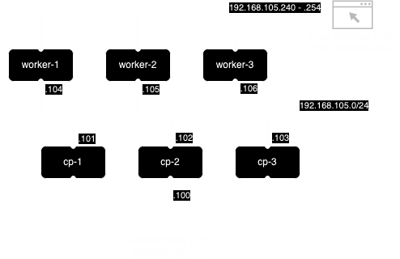

# Kubernetes on macOS (Apple silicon)
Note #1: `kube-vip` add-on is incompatible with Kubernetes 1.29 (see kube-vip github issue [#684](https://github.com/kube-vip/kube-vip/issues/684)). It is possible to get this setup working with Kubernetes 1.29.x by using a [workaround](https://github.com/kube-vip/kube-vip/issues/684#issuecomment-1864855405). This workaround has also been made available in this guide.

## Project Goal
A fully functional multi-node Kubernetes cluster on macOS (Apple silicon) with support for both macOS Host - Virtual Machine (VM) and VM-VM communication with following cluster topologies.

Topologies available:
- Single Control Plane and single Worker node topology
- Single Control Plane and three Worker nodes topology
- High available Control Plane and three Worker nodes topology

## High-level Architecture
### HA Control Plan and three Worker nodes


## Current Components
### Host, Virtualization and Machines
- Host: macOS 15.5 (Sequoia)
- Virtualization: Lima VM 1.2.0 / socket_vmnet 1.2.1
- Node images: (machines) Ubuntu 24.04 LTS
### Kubernetes and Add-ons
- Kubernetes 1.33.3
- kube-vip 0.9.2 (used as Kubernetes HA Control Plane LB)
- Cilium 1.17.6 (used as CNI, L2 LB (ARP), L7 LB (Kubernetes Ingress Controller) and L4/L7 LB (Gateway API))
- Gateway API 1.2.0 (Based on Cilium CNI implementation)
- metrics-server 0.7.2 (helm chart version 3.12.1)
- local-path-provisioner 0.0.31

## Networking
Network must be available prior deploying different Kubernetes cluster topologies. Shared network with subnet `192.168.105.0/24` is used as it allows both Host-VM and VM-VM communication. By default Lima VM uses DHCP range until `192.168.105.99` therefore we use IP address range from `192.168.105.100` and onward in our Kubernetes setup. To have predictable node IPs for a Kubernetes cluster, it is neccessary to [reserve IPs](https://github.com/lima-vm/socket_vmnet#how-to-reserve-dhcp-addresses) to be used from DHCP server in macOS.

### Allocated Kubernetes node IPs
Following static IP addresses will be allocated as node IPs in a Kubernetes cluster after shared network installation procedure is completed. 
| Host     | MAC Address       | IP address      | Comments                                    |
| -------- | ----------------- | --------------- | ------------------------------------------- |
| cp       | 52:55:55:12:34:00 | 192.168.105.100 | Control Plane (CP) Virtual IP (VIP) address |
| cp-1     | 52:55:55:12:34:01 | 192.168.105.101 |                                             |
| cp-2     | 52:55:55:12:34:02 | 192.168.105.102 | Additional CP node in HA CP cluster.        |
| cp-3     | 52:55:55:12:34:03 | 192.168.105.103 | Additional CP node in HA CP cluster.        |
| worker-1 | 52:55:55:12:34:04 | 192.168.105.104 |                                             |
| worker-2 | 52:55:55:12:34:05 | 192.168.105.105 |                                             |
| worker-3 | 52:55:55:12:34:06 | 192.168.105.106 |                                             |
### Kubernetes API server
Kubernetes API server is available via VIP address `192.168.105.100`.

### L2 Aware load balancer, Ingress and Gateway
IP address pool for `Load Balancer` services must be configured to same shared subnet than Kubernetes cluster `node IPs`. Currently L2 Aware LB in Cilium CNI is used and default address pool is configured with address range `192.168.105.240 - 192.168.105.254`.

From the assigned address pool following IPs are "reserved" for default Kubernetes Ingress and Gateway API.
- `192.168.105.254` is assigned to "default" `Ingress` resource (Cilium Ingress Controller) and
- `192.168.105.253` is assigned "default" shared `Gateway` resource (Cilium Gateway API).

Note: From Cilium CNI release 1.17.x and onwards. Cilium implementation supports static IP assignments for `Gateway` resources.

## Storage
Used storage provisioner `local-path-provisioner` requires a storage path to be provisioned for its use on macOS host and exposed to a Kubernetes cluster through machine VMs.

This project assumes that a directory `/opt/lima` is available prior deploying different Kubernetes cluster topologies.

## Prerequisites
### Git Repository (this project)
Git repo has been cloned to local macOS host. All commands will be executed from repo root folder unless stated otherwise.

### Required Tools
Following tools are minimal requirements by this project. [Homebrew](https://brew.sh/) is used to install these tools on macOS host.
- [ ] [Lima VM](https://github.com/lima-vm/lima)
- [ ] [socket_vmnet](https://github.com/lima-vm/socket_vmnet/)
- [ ] [kubernetes-cli](https://github.com/kubernetes/kubectl)
- [ ] [cilium-cli](https://github.com/cilium/cilium-cli/)
- [ ] [helm](https://helm.sh/)
- [ ] [Git](https://git-scm.com/)

### Install tools
This step is required only to be executed once, prior deploying your first Kubernetes cluster topology.

Install `Homebrew`. After install is completed, follow a prompt for additional steps.
```
/bin/bash -c "$(curl -fsSL https://raw.githubusercontent.com/Homebrew/install/HEAD/install.sh)"
```

Install `Taskfile`
```
brew install go-task/tap/go-task
```

Install tools
```
task brew:install
```

### Provisioning of networking
This step is required only to be executed once, prior deploying your first Kubernetes cluster topology.

#### Install socket_vmnet
Per Lima VM networking documentation, Homebrew installation method is not recommended for `socket_vmnet`. Therefore alternative install method is used.

Install socket_vmnet binary from tar.gz archive file
```
VERSION="$(curl -fsSL https://api.github.com/repos/lima-vm/socket_vmnet/releases/latest | jq -r .tag_name)"
FILE="socket_vmnet-${VERSION:1}-$(uname -m).tar.gz"
curl -OSL "https://github.com/lima-vm/socket_vmnet/releases/download/${VERSION}/${FILE}"
sudo tar Cxzvf / "${FILE}" opt/socket_vmnet
```

#### Prepare macOS DHCP service
DHCP service in macOS host must be prepared to handover predefined static IP addresses based on MAC addresses to be assigned on machine VMs vNIC interface.

Populate DHCP configuration database on macOS host. Please note that per these instructions any possible previous configuration DB will be overwritten.
```
sudo cp macos/etc/bootptab /etc/.
```
Start macOS DHCP server and load its configuration DB
```
sudo /bin/launchctl load -w /System/Library/LaunchDaemons/bootps.plist
sudo /bin/launchctl kickstart -kp system/com.apple.bootpd
```

#### Prepare Lima VM shared networking configuration
Create networking configuration for Lima VM
```
mkdir -p ~/.lima/_config
cp macos/home/.lima/_config/networks.yaml ~/.lima/_config/.
```

#### Prepare sudoers file
Setup sudoers file to launch socket_vmnet from Lima VM
```
limactl sudoers | sudo tee /etc/sudoers.d/lima
```

#### For reference
- https://github.com/lima-vm/socket_vmnet?tab=readme-ov-file#from-binary
- https://lima-vm.io/docs/config/network/vmnet/#socket_vmnet

### Provisioning of storage paths
This step is required only to be executed once, prior deploying your first Kubernetes cluster topology.

Create storage path on macOS host for kubeconfig files
```
mkdir -p ~/.kube
chmod 700 ~/.kube
```

Create storage path on macOS host and make it world writable (this is not secure)
```
sudo mkdir -p /opt/lima
sudo chmod 777 /opt/lima
```

## Create Machines for Different Kubernetes Cluster Topologies

### Single Control Plane Node and Single Worker Node Topology
Create machines (Virtual Machines (VM) for nodes) for single Control Plane (CP) and Single Worker node cluster topology.
```
limactl create --set='.networks[].macAddress="52:55:55:12:34:01"' --name cp-1 machines/ubuntu-lts-machine.yaml --tty=false
limactl create --set='.networks[].macAddress="52:55:55:12:34:04"' --name worker-1 machines/ubuntu-lts-machine.yaml --tty=false
```

Start machines. 
```
limactl start cp-1
limactl start worker-1
```

### Single Control Plane Node and Three Worker Node Topology
Additional steps. Skip this step for single Worker Node cluster topology.

Create two additional machines (Virtual Machines (VM) for nodes) for three Worker Nodes cluster topology.
```
limactl create --set='.networks[].macAddress="52:55:55:12:34:05"' --name worker-2 machines/ubuntu-lts-machine.yaml --tty=false
limactl create --set='.networks[].macAddress="52:55:55:12:34:06"' --name worker-3 machines/ubuntu-lts-machine.yaml --tty=false
```

Start machines. 
```
limactl start worker-2
limactl start worker-3
```

### HA Control Plane and Three Worker Node Topology
Additional steps. Skip this step for single Control Plane cluster topology.

Create two additional machines for Control Plane (CP) nodes to implement HA cluster topology.
```
limactl create --set='.networks[].macAddress="52:55:55:12:34:02"' --name cp-2 machines/ubuntu-lts-machine.yaml --tty=false
limactl create --set='.networks[].macAddress="52:55:55:12:34:03"' --name cp-3 machines/ubuntu-lts-machine.yaml --tty=false
```

Start machines.
```
limactl start cp-2
limactl start cp-3
```

## Initiate Kubernetes Cluster with Different Cluster Topologies 

### Single Control Plane Node and Single Worker Node Topology

#### Prerequisites
Copy `kubeadm` config files into the machines.
```
limactl cp manifests/kubeadm/cp-1-init-cfg.yaml cp-1:
limactl cp manifests/kubeadm/worker-1-join-cfg.yaml worker-1:
```

#### Initiate Kubernetes Control Plane (CP) in CP-1 machine
Following steps are to be run inside of `cp-1` machine

Generate `kube-vip` static pod manifest
```
export KVVERSION=v0.9.2
export INTERFACE=lima0
export VIP=192.168.105.100
sudo ctr image pull ghcr.io/kube-vip/kube-vip:$KVVERSION
sudo ctr run --rm --net-host ghcr.io/kube-vip/kube-vip:$KVVERSION vip /kube-vip manifest pod \
    --arp \
    --controlplane \
    --address $VIP \
    --interface $INTERFACE \
    --enableLoadBalancer \
    --leaderElection | sudo tee /etc/kubernetes/manifests/kube-vip.yaml
```

Workaround for Kubernetes 1.29 and onward, until until bootstrap issue with `kube-vip` is fixed (Note: This step is only applicable with Kubernetes 1.29)
Patch `kube-vip.yaml` to use super-admin.conf during `kubeadm init`
```
sudo sed -i 's#path: /etc/kubernetes/admin.conf#path: /etc/kubernetes/super-admin.conf#' /etc/kubernetes/manifests/kube-vip.yaml
```

Initiate Kubernetes Control Plane (CP)
```
sudo kubeadm init --upload-certs --config cp-1-init-cfg.yaml
```

Workaround for Kubernetes 1.29 and onwards, until until bootstrap issue with `kube-vip` is fixed (Note: This step is only applicable with Kubernetes 1.29)
Patch `kube-vip.yaml` to use admin.conf after `kubeadm init` has been successfully executed
```
sudo sed -i 's#path: /etc/kubernetes/super-admin.conf#path: /etc/kubernetes/admin.conf#' /etc/kubernetes/manifests/kube-vip.yaml
```

#### Setup kubeconfig for a regular user on macOS host
Inside of `cp-1` machine copy `kubeconfig` for a regular user
```
mkdir -p $HOME/.kube
sudo cp -i /etc/kubernetes/admin.conf $HOME/.kube/config
sudo chown $(id -u):$(id -g) $HOME/.kube/config
```

On `macOS` host export and set `kubeconfig` for a regular user
```
limactl cp cp-1:.kube/config ~/.kube/config.k8s-on-macos
chown $(id -u):$(id -g) ~/.kube/config.k8s-on-macos
export KUBECONFIG=~/.kube/config.k8s-on-macos
```

#### Join worker nodes to Kubernetes cluster
Following steps are to be run inside of respective worker node machines

Join `worker-1`
```
sudo kubeadm join --config worker-1-join-cfg.yaml
```

### Single Control Plane Node and Three Worker Node Topology
Additional steps. Skip this step for single Worker Node cluster topology.

#### Prerequisites
Copy `kubeadm` config files into the machines.
```
limactl cp manifests/kubeadm/worker-2-join-cfg.yaml worker-2:
limactl cp manifests/kubeadm/worker-3-join-cfg.yaml worker-3:
```

#### Join worker nodes to Kubernetes cluster
Following steps are to be run inside of respective worker node machines

Join `worker-2`
```
sudo kubeadm join --config worker-2-join-cfg.yaml
```

Join `worker-3`
```
sudo kubeadm join --config worker-3-join-cfg.yaml
```

### High Available Control Plane Node and Three Worker Node Topology
Additional steps. Skip this step for single Control Plane cluster topology.

#### Prerequisites
Copy `kubeadm` config files into the machines.
```
limactl cp manifests/kubeadm/cp-2-join-cfg.yaml cp-2:
limactl cp manifests/kubeadm/cp-3-join-cfg.yaml cp-3:
```

#### Join other Control Plane (CP) nodes to implement High Available (HA) Kubernetes cluster
Following steps are to be run inside of `cp-2`  machine`. Skip these steps for single Control Plane Kubernetes cluster configuration.

Generate `kube-vip` static pod manifest
```
export KVVERSION=v0.9.2
export INTERFACE=lima0
export VIP=192.168.105.100
sudo ctr image pull ghcr.io/kube-vip/kube-vip:$KVVERSION
sudo ctr run --rm --net-host ghcr.io/kube-vip/kube-vip:$KVVERSION vip /kube-vip manifest pod \
    --arp \
    --controlplane \
    --address $VIP \
    --interface $INTERFACE \
    --enableLoadBalancer \
    --leaderElection | sudo tee /etc/kubernetes/manifests/kube-vip.yaml
```

Join additional Control Plane (CP) node
```
sudo kubeadm join --config cp-2-join-cfg.yaml
```

Copy `kubeconfig` for use by a regular user
```
mkdir -p $HOME/.kube
sudo cp -i /etc/kubernetes/admin.conf $HOME/.kube/config
sudo chown $(id -u):$(id -g) $HOME/.kube/config
```

Following steps are to be run inside of `cp-3` node machine`

Generate `kube-vip` static pod manifest
```
export KVVERSION=v0.9.2
export INTERFACE=lima0
export VIP=192.168.105.100
sudo ctr image pull ghcr.io/kube-vip/kube-vip:$KVVERSION
sudo ctr run --rm --net-host ghcr.io/kube-vip/kube-vip:$KVVERSION vip /kube-vip manifest pod \
    --arp \
    --controlplane \
    --address $VIP \
    --interface $INTERFACE \
    --enableLoadBalancer \
    --leaderElection | sudo tee /etc/kubernetes/manifests/kube-vip.yaml
```

Join additional Control Plane (CP)
```
sudo kubeadm join --config cp-3-join-cfg.yaml
```

Copy `kubeconfig` for use by a regular user
```
mkdir -p $HOME/.kube
sudo cp -i /etc/kubernetes/admin.conf $HOME/.kube/config
sudo chown $(id -u):$(id -g) $HOME/.kube/config
```

## Post Cluster Creation Steps

### Manual approval of kubelet serving certificates
Approve any pending `kubelet-serving` certificate
```
kubectl get csr
kubectl get csr | grep "Pending" | awk '{print $1}' | xargs kubectl certificate approve
```

### Install Cilium CNI

#### Install Gateway API Custom Resource Definitions
Install Gateway API CRDs supported by Cilium.
```
kubectl apply -f https://raw.githubusercontent.com/kubernetes-sigs/gateway-api/v1.2.0/config/crd/standard/gateway.networking.k8s.io_gatewayclasses.yaml
kubectl apply -f https://raw.githubusercontent.com/kubernetes-sigs/gateway-api/v1.2.0/config/crd/standard/gateway.networking.k8s.io_gateways.yaml
kubectl apply -f https://raw.githubusercontent.com/kubernetes-sigs/gateway-api/v1.2.0/config/crd/standard/gateway.networking.k8s.io_httproutes.yaml
kubectl apply -f https://raw.githubusercontent.com/kubernetes-sigs/gateway-api/v1.2.0/config/crd/standard/gateway.networking.k8s.io_referencegrants.yaml
kubectl apply -f https://raw.githubusercontent.com/kubernetes-sigs/gateway-api/v1.2.0/config/crd/standard/gateway.networking.k8s.io_grpcroutes.yaml
kubectl apply -f https://raw.githubusercontent.com/kubernetes-sigs/gateway-api/v1.2.0/config/crd/experimental/gateway.networking.k8s.io_tlsroutes.yaml
```

#### Install and configure Cilium CNI
Install CNI (Cilium) with L2 LB, L7 LB (Ingress Controller) and L4/L7 LB (Gateway API) support enabled.
```
export CILIUM_CHART_VERSION=1.17.6
helm repo add cilium https://helm.cilium.io/ --force-update
helm install cilium cilium/cilium \
     --version $CILIUM_CHART_VERSION \
     --namespace kube-system \
     --values manifests/cilium/values.yaml
```

Configure L2 announcements and address pool for L2 aware Load Balancer
```
kubectl apply -f manifests/cilium/l2-lb-cfg.yaml
```

Configure Gateway (default)
```
kubectl apply -f manifests/cilium/gtw-cfg.yaml
```

### Install Local path provisioner CSI
Install local path provisioner
```
kubectl apply -f https://raw.githubusercontent.com/rancher/local-path-provisioner/v0.0.31/deploy/local-path-storage.yaml
```

Apply local path provisioner configuration. There will be a delay after `configmap` is applied before the provisioner picks it up.
```
kubectl apply -f manifests/local-path-provisioner/provisioner-cm.yaml
```

### Install Metrics server add-on
Install metrics server
```
export METRICS_SERVER_CHART_VERSION=3.12.2
helm repo add metrics-server https://kubernetes-sigs.github.io/metrics-server/ --force-update
helm install metrics-server metrics-server/metrics-server \
     --version $METRICS_SERVER_CHART_VERSION \
     --namespace kube-system \
     --values manifests/metrics-server/values.yaml
```

### Install Cert-Manager add-on
Install cert-manager
```
export CERT_MANAGER_CHART_VERSION=1.18.2
helm repo add jetstack https://charts.jetstack.io --force-update
helm install cert-manager jetstack/cert-manager \
     --version $CERT_MANAGER_CHART_VERSION \
     --namespace cert-manager \
     --create-namespace \
     --values manifests/cert-manager/values.yaml
```
Create cluster issuer resource
```
kubectl apply -f manifests/cert-manager/ca-clusterissuer.yaml
```

### Install Headlamp Kubernetes WebUI (optional)
I use Headlamp Kubernetes WebUI for simple checks e.g. to confirm that TLS enabled ingress works.

Install Headlamp WebUI
```
helm repo add headlamp https://kubernetes-sigs.github.io/headlamp --force-update
helm install headlamp headlamp/headlamp --namespace kube-system \
     -f manifests/headlamp/values.yaml
```
Generate access token for Headlamp
```
kubectl create token headlamp --namespace kube-system
```
Access Headlamp WebUI through following URL. Use above generated token to authenticate. In case of issues, check your browser settings.
```
https://headlamp.sandbox.k8s.internal/
```

## Finals checks
Check from that cluster works as expected
```
kubectl version
cilium status
kubectl get --raw='/readyz?verbose'
```

## Miscellaneous Helpful Hints

### Proxying API server to macOS host
Inside a `Control Plane` node, start HTTP proxy for Kubernetes API.
```
kubectl --kubeconfig $HOME/.kube/config proxy
```

Or on `macOS` host, start HTTP proxy for Kubernetes API.
```
kubectl --kubeconfig ~/.kube/config.k8s-on-macos proxy
```

Access Kubernetes API from `macOS` host using `curl`, `wget` or any `web browser` using following URL.
```
http://localhost:8001/api/v1
```

### Exposing services via NodePort to macOS host
It is possible to expose Kubernetes services via `NodePort` to `macOS` host. Full `NodePort` range `30000-32767` is exposed to `macoS` host from provisioned `Lima VM` machines during machine creation phaase.

Actual services with `type: NodePort` will be available on `macOS` host via `node IP` address of any Control Plane or Worker nodes of a cluster (not via VIP address) and assigned `NodePort` value for a service.

### Troubleshooting socket_vmnet related issues
Update sudoers config and _config/networks.yaml file.
Currently it is neccessary to replace `socketVMNet` field in `~/.lima/_config/networks.yaml` with absolute path, instead of symbolic link and generate sudoers configuration to able to execute `limactl start`.

After `socket_vmnet` is upgraded, it is neccessary to adjust the absolute path in `networks.yaml` and regenerate sudoers configuration with
```
limactl sudoers >etc_sudoers.d_lima && sudo install -o root etc_sudoers.d_lima "/private/etc/sudoers.d/lima"
```
--- END ---