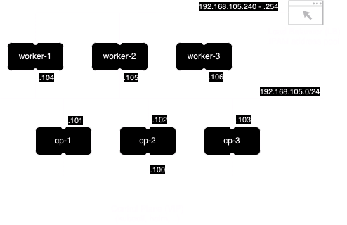

# Kubernetes on macOS (Apple silicon)
Note #1: `kube-vip` add-on is incompatible with Kubernetes 1.29 (see kube-vip github issue [#684](https://github.com/kube-vip/kube-vip/issues/684)). It is possible to get this setup working with Kubernetes 1.29.x by using a [workaround](https://github.com/kube-vip/kube-vip/issues/684#issuecomment-1864855405). This workaround has also been used in this guide.

## Project Goal
This project goal is to provision fully functional multi-node Kubernetes cluster on macOS (Apple silicon) with support for both macOS Host - Virtual Machine (VM) and VM-VM communication with multiple Kubernetes cluster topologies.

## High-level Architecture
### Supported Topologies
Following Kubernetes cluster topologies are made available:
- Single Control Plane and single Worker node topology
- Single Control Plane and three Worker nodes topology
- High available Control Plane and three Worker nodes topology
### Networking
Networking topology, using high available cluster as an example, is described in the .

Network must be available prior deploying any of Kubernetes cluster topologies. Lima VM shared network with subnet `192.168.105.0/24` is used as it allows both Host-VM and VM-VM communication. From this shared network we use IP address range from `192.168.105.100` and onward in our Kubernetes cluster.
#### Allocated Kubernetes node IPs
Following static IP addresses will be reserved as static node IPs in a Kubernetes cluster after shared network installation procedure is completed. 
| Host     | MAC Address       | IP address      | Comments                                    |
| -------- | ----------------- | --------------- | ------------------------------------------- |
| cp       | 52:55:55:12:34:00 | 192.168.105.100 | Control Plane (CP) Virtual IP (VIP) address |
| cp-1     | 52:55:55:12:34:01 | 192.168.105.101 |                                             |
| cp-2     | 52:55:55:12:34:02 | 192.168.105.102 | Additional CP node in HA CP cluster.        |
| cp-3     | 52:55:55:12:34:03 | 192.168.105.103 | Additional CP node in HA CP cluster.        |
| worker-1 | 52:55:55:12:34:04 | 192.168.105.104 |                                             |
| worker-2 | 52:55:55:12:34:05 | 192.168.105.105 |                                             |
| worker-3 | 52:55:55:12:34:06 | 192.168.105.106 |                                             |
#### Kubernetes API server
Kubernetes API server is available via VIP address `192.168.105.100` and `kube-api.sandbox.internal` is used as FQDN for Kubernetes API server.

#### L2 Aware load balancer, Ingress and Gateway
IP address pool for `Load Balancer` services is configured to same shared subnet than Kubernetes cluster `node IPs`. Currently L2 Aware LB in Cilium CNI is used and default address pool is configured with address range `192.168.105.240 - 192.168.105.254`.

From the assigned address pool following IPs are "reserved" for default Kubernetes Ingress and Gateway API.
- `192.168.105.254` is assigned to `Ingress` resource `ingress.sandbox.internal` and
- `192.168.105.253` is assigned to shared `Gateway` resource `gateway.sandbox.internal`.
### Storage
Currently `local-path-provisioner` from Rancher is used as storage provisioner. This enables to use macOS host as kubernetes storagee backend but requires a storage path to be provisioned for its use on macOS host and exposed to a Kubernetes cluster through machine configuration.

This project assumes that a directory `/opt/lima` is available prior deploying different Kubernetes cluster topologies.

## Currently Used Software Releases
When writing this following software releases are used.
### Host, Virtualization and Machines
- Host: macOS 26.3 (Tahoe)
- Virtualization: Lima VM 2.0.3 / socket_vmnet 1.2.2
### Machine images and Kubernetes
- Node images: Ubuntu 24.04 LTS
- Kubernetes 1.35.2
### Add-ons
- kube-vip 1.1.0 used as Kubernetes HA Control Plane LB
- cert-manager 1.20.x for automated lifecycle of certificates
- Cilium 1.19.x used as CNI, L2 LB (ARP), L7 LB (Kubernetes Ingress Controller) and L4/L7 LB (Gateway API)
- Gateway API 1.4.x as required by Cilium CNI and cert-manager
- flux-operator 0.44.x (or current latest) and FluxCD 2.8.x used as GitOps tool
- metrics-server 0.8.x (helm chart version 3.13.x)
- local-path-provisioner 0.0.35 (or current latest) as CSI
### Applications
- Headlamp 0.40.x (or current latest) used as Kubernetes dashboard

Note: File `k8s-on-macos.env` specifies topology to be deployed, Kubernetes, Cilium and flux-operator versions for installation using justfile.

## Prerequisites
### Clone Git Repository (this project)
Git repo has been cloned to local macOS host. All commands will be executed from this git repo root folder unless stated otherwise.

### Install Required Tools
This project needs a set of tools which are listed in `Brewfile` found in git repo root as [Homebrew](https://brew.sh/) is used to install these tools on macOS host.

Install tools by using homebrew ..
```
brew bundle install
```
or by using `justfile` command runner if you already have justfile installed in your host.
```
just bundle-install
```

### Provisioning of networking
#### Install socket_vmnet
This step is required only to be executed either prior deploying your first Kubernetes cluster topology or every time when `socket_vmnet` release needs to be upgraded.

Per Lima VM networking documentation, Homebrew installation method is not recommended for `socket_vmnet`. Therefore alternative install method is used.

Install socket_vmnet binary from tar.gz archive file
```
VERSION="$(curl -fsSL https://api.github.com/repos/lima-vm/socket_vmnet/releases/latest | jq -r .tag_name)"
FILE="socket_vmnet-${VERSION:1}-$(uname -m).tar.gz"
curl -OSL "https://github.com/lima-vm/socket_vmnet/releases/download/${VERSION}/${FILE}"
sudo tar Cxzvf / "${FILE}" opt/socket_vmnet
```
#### Prepare macOS DHCP service
This step is required only to be executed either prior deploying your first Kubernetes cluster topology.

DHCP service in macOS host must be prepared to handover predefined static IP addresses based on MAC addresses to be assigned on machine VMs vNIC interface.

Populate DHCP configuration database on macOS host. Please note that per these instructions any possible previous DHCP configuration DB will be overwritten.
```
sudo cp macos/etc/bootptab /etc/.
```
Start macOS DHCP server and load its configuration DB
```
sudo /bin/launchctl load -w /System/Library/LaunchDaemons/bootps.plist
sudo /bin/launchctl kickstart -kp system/com.apple.bootpd
```
#### Prepare Lima VM shared networking configuration
This step is required only to be executed either prior deploying your first Kubernetes cluster topology.

Create networking configuration for Lima VM
```
mkdir -p ~/.lima/_config
cp macos/home/.lima/_config/networks.yaml ~/.lima/_config/.
```
#### Prepare sudoers file
This step is required only to be executed either prior deploying your first Kubernetes cluster topology or every time when `socket_vmnet` release needs to be upgraded.

Setup sudoers file to launch socket_vmnet from Lima VM
```
limactl sudoers | sudo tee /etc/sudoers.d/lima
```
#### For reference
- https://github.com/lima-vm/socket_vmnet?tab=readme-ov-file#from-binary
- https://lima-vm.io/docs/config/network/vmnet/#socket_vmnet
### Provisioning of storage paths
This step is required only to be executed once, prior deploying your first Kubernetes cluster topology.

Create storage path on macOS host for kubeconfig files
```
mkdir -p ~/.kube
chmod 700 ~/.kube
```

Create storage path on macOS host and make it world writable (this is not secure). Needed when using 'local-path-provisioner' as CSI.
```
sudo mkdir -p /opt/lima
sudo chmod 777 /opt/lima
```
### Set KUBECONFIG on macOS host
It is assumed that `KUBECONFIG` environment variable is set in a shell used work with this project.
```
export KUBECONFIG=~/.kube/config.k8s-on-macos
```

## Create Kubernetes Cluster with Specific Topology
Life cycle for different Kubernetes cluster topologies is now automated by using `justfile`. With automation it is possible to provision machines and bootstrap Kubernetes cluster with a specified Kubernetes cluster topology.

Supported Kubernetes cluster topologies are
- Single Control Plane Node and Single Worker Node topology (minimal)
- Single Control Plane Node and Three Worker Nodes topology (non-ha) and
- Three Control Plane Nodes and Three Worker Nodes topology (ha)

How to use automation
- Specify used kubernetes cluster `TOPOLOGY` in `k8s-on-macos.env` file
- Execute `[kubeadm] recipe to generate required kubeadm init and join config files
- Execute a `[machines]` recipe to create machines
- Execute a `[kubernetes]` recipe to bootstrap Kubernetes cluster

Generate kubeadm init and join config files
```
just config-generate
```

Create machines and bootstrap Kubernetes cluster
```
just create bootstrap
```

Perform post deployment cluster healthcheck
```
just healthcheck
```

## Configure Kubernetes Cluster with GitOps (optional)
FluxCD is used to configure Kubernetes cluster based on `sandbox` cluster GitOps overlay.

Set secret for Git repository used by flux instance (optional)
```
kubectl apply -f infra/sandbox/flux/secret.yaml
```
Deploy flux instance which configures cluster
```
kubectl apply -f infra/sandbox/flux/fluxinstance.yaml
```

## Available Applications (optional)
### Headlamp Kubernetes Dashboad
Headlamp Kubernetes WebUI is a handy way visualize Kubernetes clusters.Headlamp deployment also comes with cert-manager plugin configured. It is available through

Kubernetes Ingress
```
https://headlamp.ingress.sandbox.internal
```
and Gateway API
```
https://headlamp.sandbox.internal
```
Generate token to authenticate
```
kubectl create token -n headlamp headlamp
```
### Hubble UI
Hubble is a Cilium tool to inspect network flows. It is available through Gateway API
```
https://hubble-ui.sandbox.internal
```
### Flux UI
FluxCD now comes with UI when using flux-operator. It is available through Gateway API
```
https://flux-ui.sandbox.internal
```

## Helpful Hints
### Proxying API server to macOS host
Inside a `Control Plane` node, start HTTP proxy for Kubernetes API.
```
kubectl --kubeconfig $HOME/.kube/config proxy
```
or on `macOS` host, start HTTP proxy for Kubernetes API.
```
kubectl --kubeconfig ~/.kube/config.k8s-on-macos proxy
```

Access Kubernetes API from `macOS` host using `curl`, `wget` or any `web browser` using following URL.
```
http://localhost:8001/api/v1
```
### Exposing services via NodePort to macOS host
It is possible to expose Kubernetes services via `NodePort` to `macOS` host. Full `NodePort` range `30000-32767` is exposed to `macoS` host from provisioned `Lima VM` machines during machine creation phaase.

Actual services with `type: NodePort` will be available on `macOS` host via `node IP` address of any Control Plane or Worker nodes of a cluster (not via VIP address) and assigned `NodePort` value for a service.
### Working with Network Policies
Cilium has a handy online to which helps to design network policies
```
https://editor.networkpolicy.io
```
## Troubleshooting Tips
### Kubernetes cluster not reachable from host
Check that `KUBECONFIG` environment variable is set according to prerequisites.
### Troubleshooting socket_vmnet related issues
Update sudoers config and _config/networks.yaml file.
Currently it is neccessary to replace `socketVMNet` field in `~/.lima/_config/networks.yaml` with absolute path, instead of symbolic link and generate sudoers configuration to able to execute `limactl start`.

After `socket_vmnet` is upgraded, it is neccessary to adjust the absolute path in `networks.yaml` and regenerate sudoers configuration with
```
limactl sudoers >etc_sudoers.d_lima && sudo install -o root etc_sudoers.d_lima "/private/etc/sudoers.d/lima"
```
--- END ---